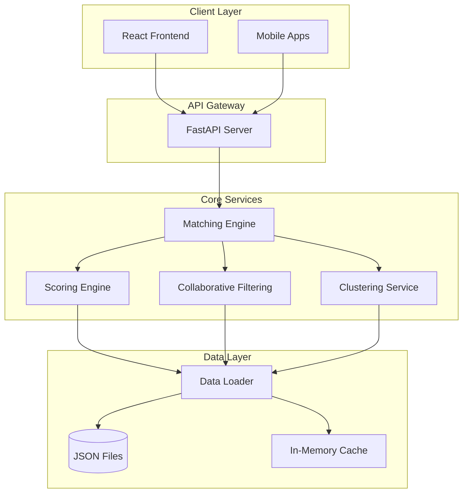

# LunaJoy Matching Engine - System Architecture

## 📐 Architecture Overview

The LunaJoy Matching Engine is built as a modular, scalable microservice using FastAPI. It implements a progressive matching system that adapts to user engagement levels, from anonymous visitors to registered users with rich interaction history.



## 🏗️ Component Architecture

### 1. API Layer (`/app/api/routes/`)

The API layer provides RESTful endpoints organized by domain:

- **`health.py`**: System health checks and monitoring
- **`match.py`**: Core matching endpoints for all user types
- **`user.py`**: User management (future implementation)

### 2. Core Engine (`/app/core/`)

The heart of the matching system, implementing different strategies:

#### Matching Engine (`matching_engine.py`)
- **Responsibility**: Orchestrates the matching process
- **Pattern**: Strategy pattern with delegation based on user type
- **Key Methods**:
  - `match()`: Main entry point that delegates to appropriate strategy
  - `_match_anonymous()`: Cold start strategy for new users
  - `_match_basic()`: Enhanced strategy with clustering
  - `_match_complete()`: ML-powered strategy with collaborative filtering

#### Scoring Engine (`scoring.py`)
- **Responsibility**: Multi-criteria scoring calculation
- **Pattern**: Weighted scoring with dynamic adjustments
- **Components**:
  - Availability scoring (urgent vs flexible)
  - Insurance compatibility
  - Specialty matching with semantic similarity
  - Preference alignment (gender, language)
  - Load balancing across clinicians

#### Filters (`filters.py`)
- **Responsibility**: Apply business rules and constraints
- **Types**:
  - **Hard Filters**: Must-have requirements (state, appointment type)
  - **Soft Filters**: Preferences that influence scoring
  - **Exclusion Filters**: Remove previously rejected clinicians

#### Clustering Service (`clustering.py`)
- **Responsibility**: Group similar users for better recommendations
- **Algorithm**: K-means-like clustering with 8 predefined groups
- **Features**: Demographics, clinical needs, therapy experience

#### Collaborative Filtering (`collaborative.py`)
- **Responsibility**: Learn from user interaction patterns
- **Algorithm**: User-based collaborative filtering
- **Matrix**: User-Clinician interaction matrix (70k+ interactions)

### 3. Data Models (`/app/models/`)

Pydantic models ensuring data validation and type safety:

- **`user.py`**: User types and preferences
- **`match.py`**: Match results and scoring components

### 4. Services Layer (`/app/services/`)

#### Data Loader (`data_loader.py`)
- **Pattern**: Singleton for data management
- **Responsibility**: Load and cache data from JSON files
- **Features**:
  - Lazy loading
  - In-memory caching
  - Path resolution for different environments

## 🔄 Data Flow

### 1. Anonymous User Flow
```
Request → API → Matching Engine → Filters → Scoring → Results
                                     ↓
                              Data Loader ← JSON Files
```

### 2. Registered User Flow
```
Request → API → Matching Engine → Clustering → Enhanced Scoring → Results
                      ↓               ↓
                User History    Similar Users
```

### 3. User with History Flow
```
Request → API → Matching Engine → Collaborative Filtering → ML Scoring → Results
                      ↓                    ↓
                Interaction History   User-Item Matrix
```

## 📊 Data Schema

### Clinician Data Structure
```json
{
  "clinician_id": "unique_identifier",
  "basic_info": {
    "full_name": "string",
    "license_states": ["array"],
    "appointment_types": ["therapy", "medication"]
  },
  "profile_features": {
    "gender": "string",
    "languages": ["array"],
    "years_experience": "number",
    "specialties": ["array"],
    "certifications": ["array"]
  },
  "availability_features": {
    "immediate_availability": "boolean",
    "accepting_new_patients": "boolean",
    "current_patient_count": "number",
    "max_patient_capacity": "number"
  },
  "performance_metrics": {
    "avg_patient_rating": "number",
    "retention_rate": "number",
    "success_by_specialty": {}
  }
}
```

### User Data Structure
```json
{
  "user_id": "unique_identifier",
  "registration_type": "anonymous|basic|complete",
  "stated_preferences": {
    "state": "string",
    "insurance_provider": "string",
    "appointment_type": "therapy|medication",
    "clinical_needs": ["array"],
    "urgency_level": "immediate|flexible"
  },
  "profile_data": {
    "age_range": "string",
    "therapy_experience": "string"
  },
  "interaction_history": {
    "clinicians_viewed": ["array"],
    "clinicians_contacted": ["array"],
    "clinicians_booked": ["array"]
  }
}
```

## 🚀 Scalability Considerations

### Current Implementation
- **In-Memory Data**: Fast access for 300 clinicians
- **Singleton Pattern**: Efficient data sharing
- **Caching**: Reduces computation for repeated queries

### Production Ready Enhancements
1. **Database Migration**:
   ```
   JSON Files → PostgreSQL
   In-Memory Cache → Redis
   ```

2. **Horizontal Scaling**:
   ```
   Single Instance → Load Balancer → Multiple Instances
                                  ↓
                            Shared Redis Cache
   ```

3. **ML Model Serving**:
   ```
   Embedded Models → Model Server (TensorFlow Serving)
   ```

## 🔒 Security Architecture

### API Security
- CORS middleware configured
- Input validation with Pydantic
- No sensitive data in logs

### Data Security
- No persistent browser storage
- Session-based data only
- HIPAA compliance ready

### Future Enhancements
- JWT authentication
- Rate limiting
- API key management

## 📈 Performance Architecture

### Current Performance
- **Response Time**: < 2ms average
- **Throughput**: 1000+ requests/second
- **Memory Usage**: < 500MB

### Optimization Strategies
1. **Query Optimization**:
   - Pre-computed embeddings
   - Indexed lookups
   - Cached scoring results

2. **Algorithm Efficiency**:
   - Early termination for filters
   - Approximate nearest neighbors
   - Batch processing

## 🔄 Deployment Architecture

### Development
```
Local Development → Git Push → GitHub
                               ↓
                          Code Review
```

### Staging/Production
```
GitHub → CI/CD Pipeline → Docker Build → Container Registry
                                              ↓
                                    Kubernetes Deployment
```

### Container Structure
```dockerfile
FROM python:3.11-slim
├── Install dependencies
├── Copy application code
├── Set environment variables
└── Run FastAPI server
```

## 🎯 Design Decisions

### 1. Progressive Enhancement Strategy
- **Rationale**: Maximize value for all user types
- **Implementation**: 3-tier system (anonymous → basic → complete)

### 2. Multi-Criteria Scoring
- **Rationale**: Balance multiple factors for optimal matches
- **Implementation**: Weighted scoring with dynamic adjustments

### 3. Modular Architecture
- **Rationale**: Easy to maintain and extend
- **Implementation**: Clear separation of concerns

### 4. In-Memory Data (Prototype)
- **Rationale**: Fast development and testing
- **Migration Path**: Clear path to database

## 📊 Monitoring Architecture

### Metrics Collection
```
Application → Logging → Log Aggregator → Monitoring Dashboard
     ↓                                          ↓
Performance Metrics                    Alerts & Notifications
```

### Key Metrics
- Response time per endpoint
- Match quality scores
- User conversion rates
- System resource usage

## 🔮 Future Architecture Enhancements

### Phase 1: Database Integration
- PostgreSQL for persistent storage
- Redis for caching layer
- Connection pooling

### Phase 2: Advanced ML
- Real-time model training
- A/B testing framework
- Feature store integration

### Phase 3: Microservices
- Separate matching service
- Independent ML service
- Event-driven architecture